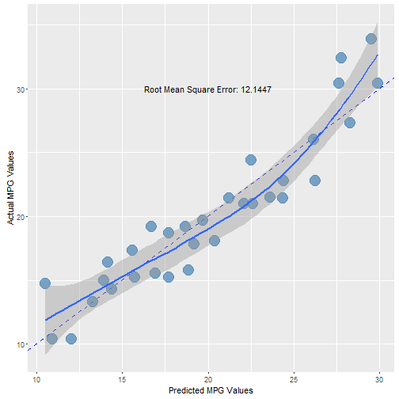

Data Products Pursuasive Presentation
========================================================
author: Mark Bulkeley
date: 2016-06-06
autosize: true

Interactive Linear Regression
========================================================

Showing students how regression changes is important:

- It's interactive - instant feedback
- Reenforces ideas and concepts taught in classroom setting
- Relevant interface: on the web where students are at home

What dataset is used?
========================================================

- The `mtcars` dataset is used given students' familiarity with it.

```
'data.frame':	32 obs. of  11 variables:
 $ mpg : num  21 21 22.8 21.4 18.7 18.1 14.3 24.4 22.8 19.2 ...
 $ cyl : num  6 6 4 6 8 6 8 4 4 6 ...
 $ disp: num  160 160 108 258 360 ...
 $ hp  : num  110 110 93 110 175 105 245 62 95 123 ...
 $ drat: num  3.9 3.9 3.85 3.08 3.15 2.76 3.21 3.69 3.92 3.92 ...
 $ wt  : num  2.62 2.88 2.32 3.21 3.44 ...
 $ qsec: num  16.5 17 18.6 19.4 17 ...
 $ vs  : num  0 0 1 1 0 1 0 1 1 1 ...
 $ am  : num  1 1 1 0 0 0 0 0 0 0 ...
 $ gear: num  4 4 4 3 3 3 3 4 4 4 ...
 $ carb: num  4 4 1 1 2 1 4 2 2 4 ...
```

Plot Functionality is Impressive
========================================================

- The shiny app allows for simple plotting that depends on the inputs from the check boxes
- Familiarity that you have with ggplot2 readily transfers to the web application!
- The below shows the sample graph from the shiny application.



Code can be Shared Across Applications
========================================================
- With proper planning and structuring, you can share important code between applications.
  - Assume you had a special model that you'd apply to data in a similar way.
  - Write that once and then reference from both of your shiny applications
- Efficient and quick
  - Turn _ad hoc_ analysis into web applications quickly and easily
  - Allow management to tweak variables themselves so you don't sit in meetings endlessly changing input variables
  - Capture key outputs simply for static reports
  
Summary
===
- Use interactive Shiny applications to teach the linear regression interactively!
- See an example application here: <a href="https://markbulk.shinyapps.io/CourseraDataProducts_FinalProject/">Interactive Linear Regression</a>
- The R code to build it can be found on <a href="https://github.com/markbulk/CourseraDataProducts">GitHub</a> (see the app.R file).
